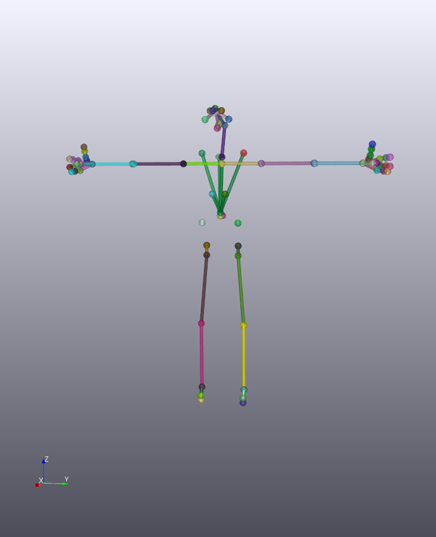
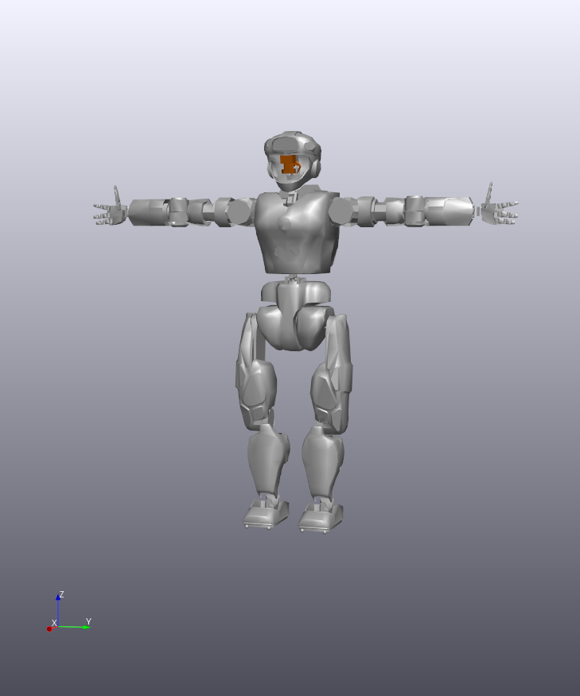

# RigidBodyTreeInspector

This package provides a simple tool for inspecting and manipulating the kinematic structure of a robot inside of an [IJulia](https://github.com/JuliaLang/IJulia.jl) notebook. It relies on several other packages to provide this functionality:

* [tkoolen/RigidBodyDynamics.jl](https://github.com/tkoolen/RigidBodyDynamics.jl) to parse and represent kinematic structures
* [RobotLocomotion/director](https://github.com/RobotLocomotion/director) for 3D visualization
* [rdeits/DrakeVisualizer.jl](https://github.com/rdeits/DrakeVisualizer.jl) to communicate with `director`
* [rdeits/PyLCM.jl](https://github.com/rdeits/PyLCM.jl) for message-passing and communication

## Demos

For detailed examples of usage, check out the IJulia notebook demos in [examples](https://github.com/rdeits/RigidBodyTreeInspector.jl/tree/master/examples).

# Examples

Here we show the three different visualization modes available in this package. In each case, we'll be looking at the NASA Valkyrie robot, which we loaded from the URDF files in <https://github.com/RobotLocomotion/drake/tree/master/drake/examples/Valkyrie>. These results are all taken from [examples/urdf.ipynb](https://github.com/rdeits/RigidBodyTreeInspector.jl/blob/master/examples/urdf.ipynb)

### Pure kinematic skeleton

This visualization shows every joint in the model as a sphere, with a cylindrical rod between every pair of connected joints. It's useful primarily for inspecting the way various joints and bodies can move.

When rendered inside an IJulia notebook, a slider is created for each joint in the model:

### Inertial ellipsoids

The inertial visualization adds to every link on the robot an ellipsoid which would have the same mass and rotational inertia as the robot's actual link. Note that different ellipsoids may have different densities, so this may produce strange results for robot links that have large rotational inertias but small masses (like the fingers in the Valkyrie model):

### Meshes

Finally, we can render the actual meshes for each link in the robot:

